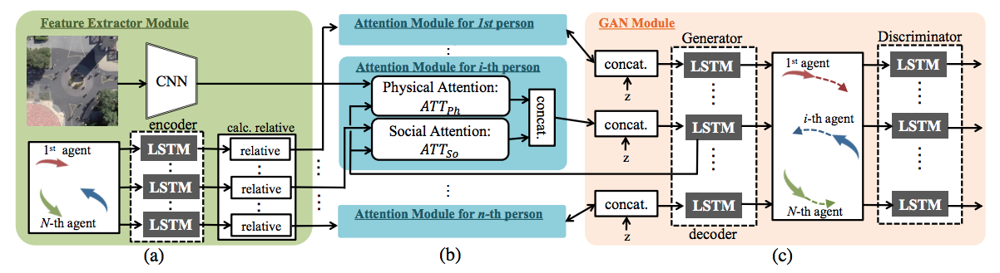

# Sophie

This is the implementation of Sophie, an attentive GAN for predicting paths compliant to social and physical constraints, presented at [CVPR 2019](http://cvrp2019.thecvf.com/).

**<a href="https://arxiv.org/abs/1806.01482">SoPhie: An Attentive GAN for Predicting Paths Compliant to Social and Physical Constraints</a>**
<br>
<a href="https://scholar.google.com/citations?user=ZqbHW0gAAAAJ&hl=en">Amir Sadeghian</a>,
<a href="https://profiles.stanford.edu/vineet-kosaraju">Vineet Kosaraju</a>,
<a href="https://scholar.google.se/citations?user=0asq4zoAAAAJ&hl=en">Ali Sadeghian</a>,
<a href="https://scholar.google.co.jp/citations?user=xvOlfw8AAAAJ&hl=ja">Noriaki Hirose</a>,
<a href="https://scholar.google.com/citations?user=VxAuxMwAAAAJ&hl=en">Hamid Rezatofighi</a>,
<a href="http://cvgl.stanford.edu/silvio/">Silvio Savarese</a>
<br>

<div align='center'>
</img>
</div>

## Architecture

This work addresses the problem of path prediction for multiple interacting agents in a scene, which is a crucial step for many autonomous platforms such as self-driving cars and social robots. We present SoPhie; an interpretable framework based on Generative Adversarial Network (GAN), which leverages two sources of information, the path history of all the agents in a scene, and the scene context information, using images of the scene. To predict a future path for an agent, both physical and social information must be leveraged. Previous work has not been successful to jointly model physical and social interactions. Our approach blends a social attention mechanism with a physical attention that helps the model to learn where to look in a large scene and extract the most salient parts of the image relevant to the path. Whereas, the social attention component aggregates information across the different agent interactions and extracts the most important trajectory information from the surrounding neighbors. SoPhie also takes advantage of GAN to generates more realistic samples and to capture the uncertain nature of the future paths by modeling its distribution. All these mechanisms enable our approach to predict socially and physically plausible paths for the agents and to achieve state-of-the-art performance on several different trajectory forecasting benchmarks.

<div align='center'>
</img>
</div>

## Reference

```
@inproceedings{sophie19,
  title={SoPhie: An Attentive GAN for Predicting Paths Compliant to Social and Physical Constraints},
  author={Sadeghian, Amir and Kosaraju, Vineet and Sadeghian, Ali and Hirose, Noriaki and Rezatofighi, Hamid and Savarese, Silvio}
  booktitle={IEEE Conference on Computer Vision and Pattern Recognition (CVPR)},
  number={CONF},
  year={2019}
}
```

## Setup

This codebase is based off of the Social GAN codebase and so should be similarily easy to setup and train. To run, adjust the parameters in `constants.py` and run `python train.py`. This will periodically save model checkpoints; upon completion run `python evaluate.py`. The files and class names should be easy to understand - all the data loading happens in `data.py`, and all the model architectures are defined in `models.py`.

Our main proposed architectural changes can be found in the physical and social attention modules in `models.py`, as well as the sorting in the `data.py`.

## Future Work

For efficiency sake, we only attend once per timestep, as experimentally there were not significant accuracy improvements (potentially due to the shorter nature of the trajectories). Some other possible improvements could be:

* Using a global discriminator instead of a local discriminator

* Exploring other featurizations to be passed into the encoder (global movement instead of relative movement, calculated agent interactions, etc.)

* Extend the network to longer trajectory sequences and try attending over every timestep

* Modify the physical attention to incorporate a coordinate conv.